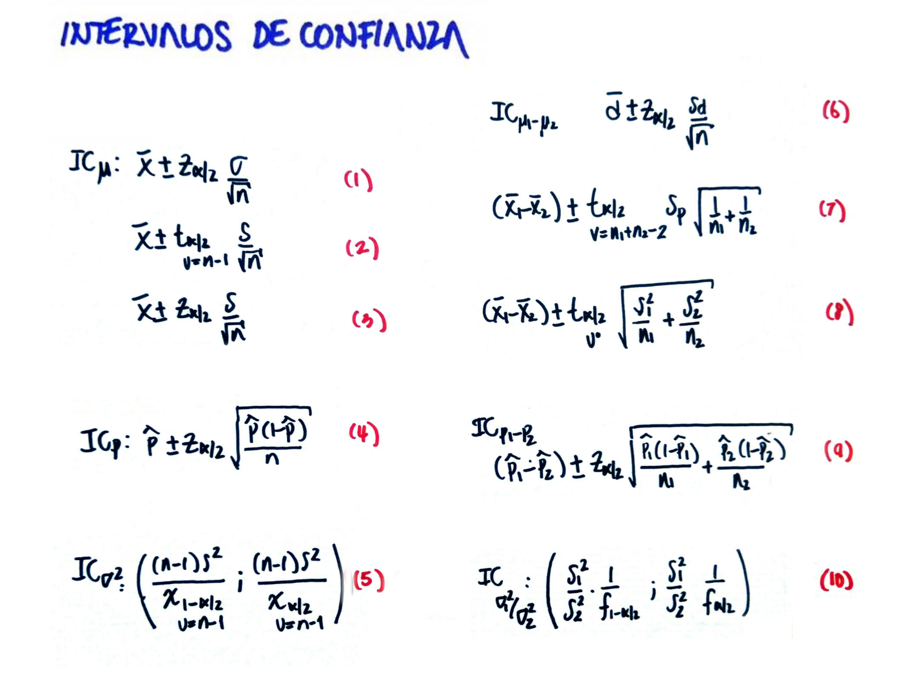
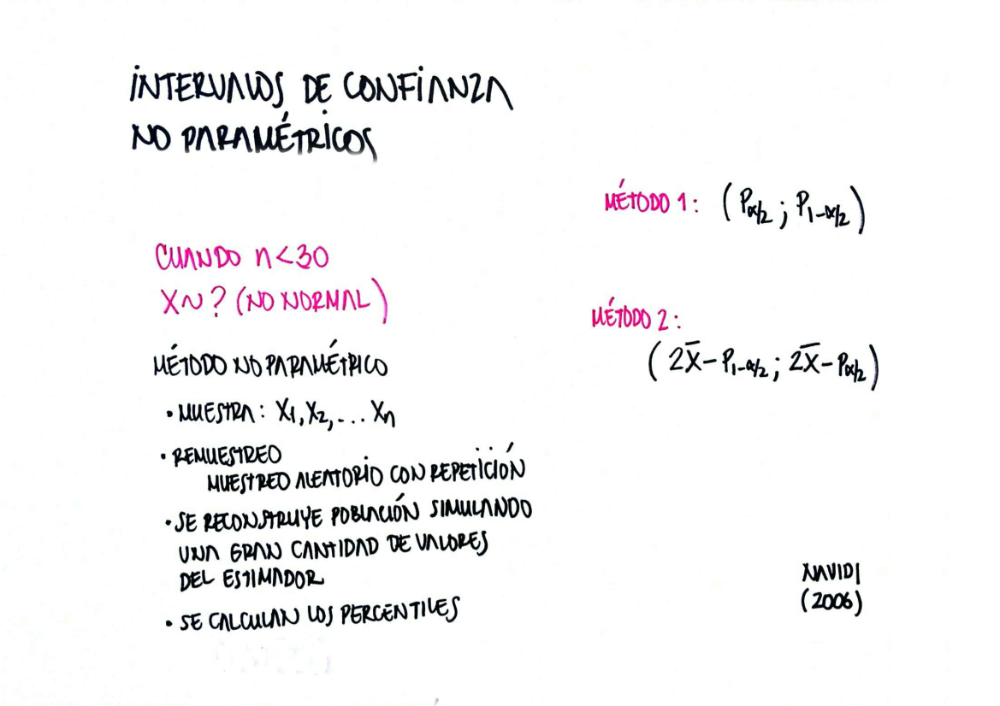

```{r setup, include=FALSE}
library(knitr)
```

# Problema 1
En cuentre e interprete un intervalo de confianza del 95% para una media poblacional $\mu$ para los valores:

+ $n=36$, $\bar{x}= 13.1$, $s^{2}=3.42$ , suponga que $X\sim$ normal

Dado que se supone que la variable tiene distribucion normal y la varianza no es conocida, se utiliza la distribucion t-studen con v=n-1=35 grados de libertad para la construccion del intervalo de confianza.

$$\bar{x}\pm t_{\alpha/2; v=n-1} \dfrac{s}{\sqrt{n}} $$


```{r}
n=36              # tamaño de la muestra
mx=13.1           # media muestral
s2=3.42           # varianza nuestral 
mx + qt(c(0.025,0.975),n-1)*sqrt(s2/n)  # calculo del intervalo de confianza
```
Ei intervalo obtenido se lee: La media se encuentra entre 12.47 y 13.73 con una confianza del 95%

+ $n=64$, $\bar{x}= 2.73$, $s^{2}=0.1047$, suponga que $X \sim$ normal 

En este caso al igual del problema anterior se trata de una variable que se supone normal con varianza desconocida. 

$$\bar{x}\pm t_{\alpha/2; v=n-1} \dfrac{s}{\sqrt{n}} $$

```{r}
n=64            # tamaño de la muestra
mx=2.73         # media muestral 
s2=0.1047       # varianza muestral
mx + qt(c(0.025,0.975),n-1)*sqrt(s2/n)
```

+ $n=125$, $\bar{x}=0.84$, $s^{2}=0.086$, suponga que se desconoce la distribucion de $X$

En este caso no se cooce la distribucion de la variable, sinembargo por tener la muestra mas de 30 observaciones se emplea el Teorema Central del Limite para determinar la construccion del intervalo de confianza con la distribucion normal

$$\bar{x} \pm z_{\alpha/2} \dfrac{s}{\sqrt{n}} $$

```{r}
n=125             # tamaño de muestra
mx=0.84           #  media muestral
s2=0.086          # varianza muetral

mx + qnorm(c(0.025,0.975))*sqrt(s2/n)
```


# Problema 2
El departamento de carnes de una cadena de supermercados empaca la carne molida en vandejas de dos tamaños: una esta diseñada para contener mas o menos 1 libra de carne y la otra para casi 3 libras.  Una muestra aleatoria de 35 paquetes de la bandeja mas pequeña produjo mediciones de peso con un promedio de $1.01$ libras y una desviacion estandar de $0.18$ libras.

+  Encuentre una intervalo de confianza del 99% para el promedio de los paquetes mas pequeños.

+ El departamento de control de calidad de esta cadena de supermercados piensa que la cantidad de carne molidas debe ser en promedio de 1 libra. ¿Debe preocupar al departamento de control de la calidad el resultado obtenido para el IC(99%)


En este caso se tiene una muestra de tamaño $n=35$, la cual se puede ser considerada como grande y con ello utilizar el Teorema Central del Limite

$$\bar{x} \pm z_{\alpha/2} \dfrac{s}{\sqrt{n}} $$

```{r}
n=35         # tamaño de muetra
mx=1.01      # media muestral
s=0.18       # desviacion estandar muestral

mx + qnorm(c(0.005,0.995))*s/sqrt(n)
```


# Problema 3
Se considera usar dos marcas diferentes de pinturas. Se seleccionaron 15 tipos de pintuas de cada marca para los cuales se midio el tiempo de secado en horas, obteniendo los siguientes resultados

```{r}
A=c(3.5,2.7, 3.9, 4.2, 3.6, 2.7, 3.3, 5.2, 4.2, 2.9, 4.4, 5.2, 4.0, 4.1, 3.4)
B=c(4.7, 3.9, 4.5, 5.5, 4.0, 5.3, 4.3, 6.0, 5.2, 3.7, 5.5, 6.2, 5.1, 5.4, 4.8)

boxplot(data.frame(A,B))  #  grafico de cajas para visualizar la informacion
summarytools::descr(data.frame(A,B))  # descriptivas

var.test(B,A)  # comparacion de varianzas
# comparacion de medias
t.test(B,A,               #  variables a comparar
       paired = FALSE,    #  grupos no pareados  o grupos independientes  
       var.equal = TRUE,  #  varoamzas oguales 
       conf.level = 0.95) #  nivel de confianza


```


Suponga que el tiempo de secado se distribuye normal . Calcule un intervalo de confianza para la diferencia de medias e interprete su resultado

En este caso se trata de un intervalo de confianza para comparar medias de dos grupos independientes, por lo que es necesario primero determinar su sus varianzas se pueden considerar como iguales o si son diferentes.

Para realizarlos construimos un intervalo de confianza para la razon de varianza utilizando la funcion **var.test(A,B)**

El resultado obtenido indica que las varianzas se pueden considerar iguales por lo que se emplea la funcion:

**t.test(B,A,paired = FALSE, var.equal = TRUE, conf.level = 0.95)**

Los resultados indican que un intervalo de confianza : (0.5465157 ; 1.6934843), lo cual indica que la diferencia promedio del tiempo de secado para las dos marcas de pintura esta entre 0.54 y 1.69 horas.  Este intervalo (+,+) indica que $\mu_{B} > \mu_{A}$, indicando esto que la marca de pintura $A$ tienen un tiempo de secado menor que los tiempo de secado para la marca $B$ 


# Problema 4

En una encuesta aleatoria realizada a 500 familias de la ciudad que poseen television por cable,  se encuentra que 340 tienen suscripcion a HBO.  Calcule un intervalo de confianza para la proporcion de familias que tienen suscripcion a HBO en la ciudad. Interprete el resultado obtenido.

```{r}
x=340
n=500

ICp=prop.test(x,n, conf.level = 0.95)
ICp$conf.int
```


# Problema 5
Suponga que se desea realizar un estudio en la ciudad para estimar la proporcion de familias que tienen suscripcion a HBO, con el fin de repetir el estudio despues de dos meses, de tal forma que permita validar el efecto de publicidad de estos canales de television. Si se requiere estimar una intervalo de confianza para la proporcion con un 95% de confianza y que la estimacion de $p$ este dentro de 0.02 del valor verdadero, ¿Que tan grande debe ser la muestra?
```{r}
qnorm(0.975)^2*0.25/0.02^2  #  tamañp de muestra del 95% de confianza y error del 0.02
qnorm(0.975)^2*0.25/0.03^2  #  tamañp de muestra del 95% de confianza y error del 0.03
qnorm(0.975)^2*0.25/0.05^2  #  tamañp de muestra del 95% de confianza y error del 0.05
```

# Problema 6
Se afirma que una parsona podra reducir su peso en un periodo de dos semanas un promedio de 4.5 kilogramas con una nueva dieta. Los pesis de 7 mujeres de siguieron  esta dieta se registraron antes y despues de un periodo de dos semanas.

```{r}
pesant=c(58.2, 60.3, 61.3, 69.0, 64.0, 62.6, 56.7) # peso antes de la dieta
pesdes=c(60.0, 54.9, 58.1, 62.1, 58.5, 59.9, 54.4) # peso despues de  la dieta

boxplot(data.frame(pesant,pesdes))
summarytools::descr(data.frame(pesant,pesdes))
ICd=t.test(pesant,pesdes, paired = TRUE,conf.level = 0.95)
ICd$conf.int
```

En este caso se trata de una comparacion de medias de grupos pareados, donde se registran los valores de 7 personas medidas en dos momentos. Utilizamos la funcion : **t.test(pesant,pesdes, paired = TRUE,conf.level = 0.95)** indicando que se trata de grupos pareados

Pruebe la afirmacion sobrela dieta calculando un intervalo de confianza del 95% para la diferencia de medias . Suponga que las diferencias de los pesos se distribuyen aproximadamente normal.


# Problema 7

El conjunto de datos de iris (de Fisher o Anderson) contiene las medidas en centímetros de las variables longitud y ancho del sépalo y largo y ancho del pétalo, respectivamente, para 50 flores de cada una de las 3 especies de iris : setosa, versicolor y virginica.

```{r}
data(iris) # conjunto de datos iris
head(iris) # primeros 6 registros de la base iris

iris2a=subset(iris, iris$Species=="setosa")
iris2b=subset(iris, iris$Species=="virginica")
var.test(iris2a$Sepal.Length, iris2b$Sepal.Length)
t.test(iris2a$Sepal.Length, iris2b$Sepal.Length, var.equal = FALSE, paired = FALSE, conf.level = 0.95)

```

Determine intervalos de confianza para cada una de las caracteristicas por espacies.
Existen diferencias entre los promedio del largo de los sepalos de las especies setosa y virginica?

Para construir un intervalo de confianza para la diferencia de medias del ancho de los sepalos para las especies setosa y virginica corresponde a dos muestras independientes.  Inicialmente es necesario verificar si se los grupos presentan varianza iguales o diferentes. 

Los resultados del intervalo de confianza para la razon de varianzas (0.1743776 ; 0.5414962)  indican que las varianza de los dos grupos son diferentes.

Al comparar las medias se obtiene un intervalo de confianza : (-1.78676 ; -1.37724), lo cual indica que la diferencia de medias es negativa. Lo cual indica que la media del largo del selo para la especie setosa es menor que la media del largo del sepalo de la especie virginica.


# Problema 8
Cuántos artículos deben incluirse en una muestra para estimar la proporción de defectuosos con un error no mayor del 2% y confiabilidad del 95%

# Problema 9

De 1000 casos seleccionados al azar de cáncer de pulmón, 823 resultaron en la muerte dentro de los 10 años despues de su detección. Construya un intervalo de confianza para la tasa de mortalidad por cáncer de pulmón del 95\%, de acuerdo con los datos suministrados. Interprete los resulados obtenidos.

# Problema 10

A seis ingenieros que trabajan para el estado se les solicito realizar un pronostico la tasa de inflacion para el añno entrante. La misma peticion se le realizo a ocho especialistas en finanzas que
trabajan para el sector privado. Los pronosticos entregado por los ingenieros son los siguientes:
4.2 %, 5.1 %, 3.9 %, 4.7 %, 4.8 %, 5.8 %. 
Por su parte los especialistas en finanzas pronosticaron:
5.7 %, 6.1 %, 5.2 %, 4.9 %, 4.6 %, 4.5 %, 5.2 %, 5.5 %. ¿Estan los especialistas (ingenieros y financieros) realizando pronosticos similares? . Suponga que los pronosticos realizados tienen distribucion normal. Construye un intervalo de confianza para la diferencia de los promedios realizados por los ingenieros y los especializadas en finzanzas del 95%. Concluya a partir de los resultados.


# Problema 11
Los siguientes datos corresponden a las notas finales del curso de matematicas fundamentales.

```{r}
nf=c(4.1, 2.7, 3.1, 3.2, 3.0, 3.2, 2.0, 2.4, 1.6, 3.2, 3.1, 2.6, 2.0, 2.4, 2.8, 
     3.3, 4.0, 3.4, 3.0, 3.1, 2.7, 2.7, 3.0, 3.8, 3.2, 2.2, 3.5, 3.5, 3.8, 3.5, 
     3.9, 4.2, 4.3, 3.9, 3.2, 3.5, 3.5, 3.7, 4.1, 3.7, 3.5, 3.6, 3.2, 3.1, 3.4, 
     3.0, 3.0, 3.0, 2.7, 1.7, 3.6, 2.1, 2.4, 3.0, 3.1, 2.5, 2.5, 3.6, 2.2, 2.4, 
     3.1, 3.3, 2.7, 3.7, 3.0, 2.7, 3.0, 3.2, 3.1, 2.4, 3.0, 2.7, 2.5, 3.0, 3.0, 
     3.0, 3.2, 3.1, 3.8, 4.1, 3.7, 3.5, 3.0, 3.7, 3.7, 4.1, 3.7, 3.9, 3.7, 2.0)

hist(nf)
plot(density(nf))
qqnorm(nf)
qqline(nf, col="red")
shapiro.test(nf)  # asuminos que la variable nf es normal

ICm=t.test(nf)
ICm$conf.int
```

Construya un intervalo del 95% confianza para el promedio de la nota final del curso de matematicas fundamentales. Interprete su resultado

# Problema 12

Una muestra de siete bloques de concreto tienen la siguiente fuerza de compresion medida en MPa . Los reultados obtenidos son:

```{r}
x=c(1367.6, 1411.5, 1318.7, 1193.6, 1406.2, 1425.7, 1572.4)
```

Estime un intervalo de confianza del 95% para la media de la fuerza de compresion de los bloques de concreto


# Resumen






